---
{"dg-publish":true,"date":"2024-11-12T17:11:43+03:00","modified_at":"2024-11-12T17:26:24+03:00","permalink":"/forge/gamedev/цикл создания настольной игры/","dgPassFrontmatter":true}
---

Слушал подкаст Bg With Us ([Яндекс.Музыка](https://music.yandex.ru/album/33087800/track/130621634?activeTab=track-list&dir=desc)) в рамках составления рейтинга настольно игровых подкастов. Там был передан цикл того, что испытывает автор-любитель.

```mermaid
stateDiagram-v2
    state "игра в своей ячейке" as playtest1
    state "игра с издателем" as playtest2
    state "опять плачем" as s2
    state "опять меняем" as s3
    state "подписываем договор" as s4
    state "все ещё меняем" as s5

    [*] --> идея
    идея --> прототип
    прототип --> playtest1
    playtest1 --> плачем
    плачем --> улучшаем
    улучшаем --> playtest1

    playtest1 --> едем
    едем --> playtest2
    playtest2 --> s2
    s2 --> s3
    s3 --> playtest2

    playtest2 --> s4
    s4 --> девелопмент
    девелопмент --> плейтесты
    плейтесты --> s5
    s5 --> девелопмент

    девелопмент --> производство
    производство --> логистика
    логистика --> продажи
```

И это пересекается с выпуском из "Радио Настолкинг" ([Яндекс.Музыка](https://music.yandex.ru/album/26456571/track/131871885?activeTab=track-list&dir=desc)), где Юрий Журавлёв сказал что у девелоперов из издательства основной метод - молоток, отвёртка, гвоздь. Эта метафора о том, насколько надо сильно надо менять игру на каждом этапе. Чем раньше, тем строже и сильнее надо всё выкидывать. За игрой должна стоять идея, дополняться чем-то сбоку и самое обидное - подтверждается это всё только через реальное/живое тестирование.
