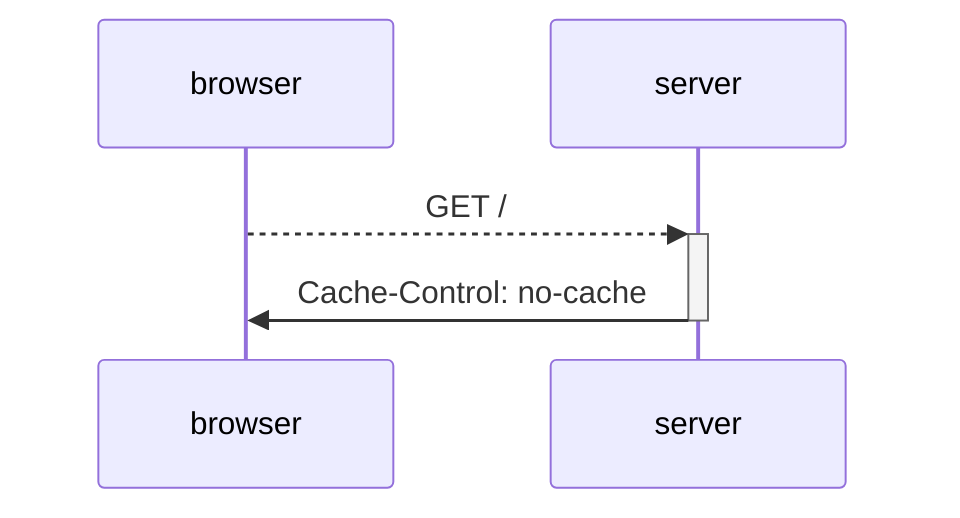
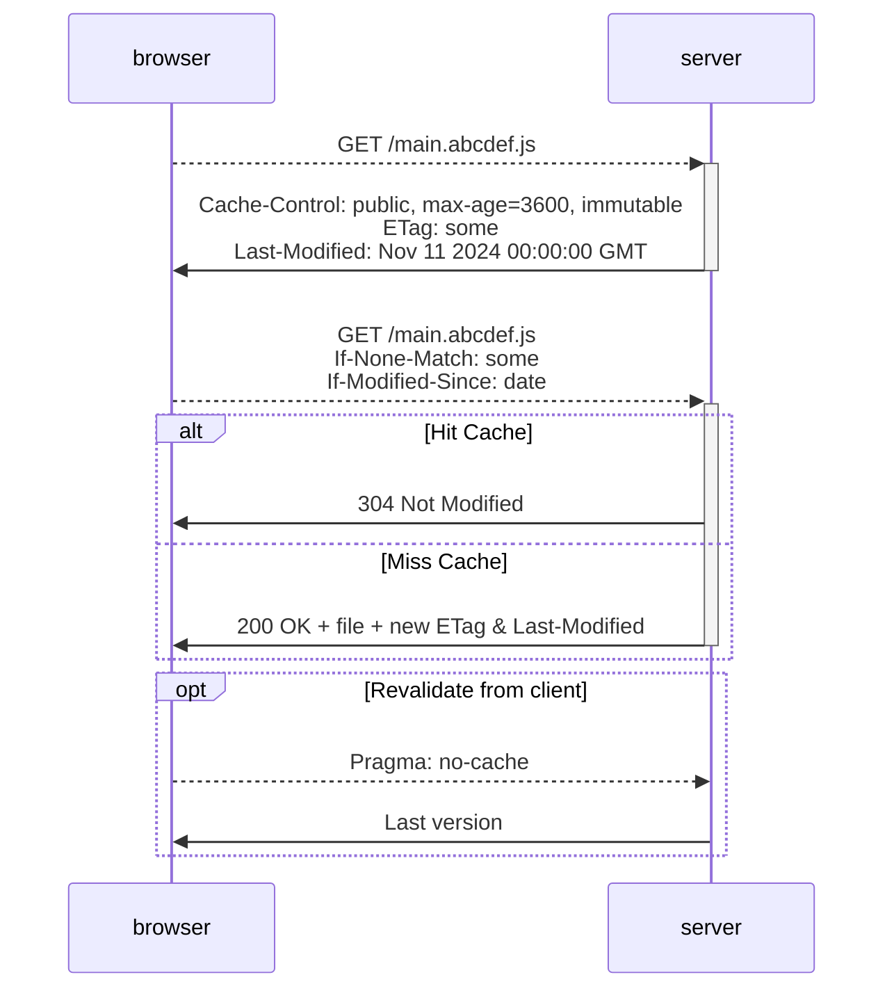

---
{"dg-publish":true,"date":"2024-10-31T13:15:14+03:00","modified_at":"2024-11-14T13:17:58+03:00","tags":["status/completed","review/pending"],"permalink":"/forge/it/кеширование в браузере/","dgPassFrontmatter":true}
---


В этой статье будет описаны стандартные заголовки, которые работают между браузером и сервером для кеширования файлов.

> [!Tip] **Перед тем, как начать.**
> Лучше просто ничего не трогать. Статические файлы, когда раздаются nginx'ом по дефолту настроены нормально.

## Схематично

### Нет кеша



### Кеширование статики



## Настройки 

Основной заголовок, в котором помещается контроль за кешированием браузера - `Cache-Control`. Он имеет формат: `command[=value]`. Перечислять все смысла нет, поэтому стандартные практики.

Никакого кеша:
```
Cache-Control: private, no-cache, must-revalidate
```

Для статических файлов (не забываем добавлять хеш в путь или название файла):
```
Cache-Control: public, max-age=31536000, immutable
```


В формирование ключа для кеша в браузере используется:
- домен
- путь
- GET параметры

## Перепроверка/revalidation кеша

При проверке кеша браузер ориентируется на два заголовка от сервера:
- ETag - это хеш версия объекта, который мы отдавали. В nginx он формируется как `"<hex(size)>-<hex(mtime)>"`
- Last-Modified - дата последнего изменения файла.

Для перепроверки кеша браузер отправляет их обратно на сервер:
1. If-None-Match - передаём последний сохранённый ETag для проверки.
2. If-Modified-Since - передаём последнюю сохранённого файла.
3. Если представлены оба заголовка, то If-None-Match считается приоритетным.

Дальше сервер отвечает 304 Not Modified - если можно дальше использовать версию из кеша. Или 200 OK, чтобы пределать новую версию.

## Источники

- [Как всегда MDN](https://developer.mozilla.org/en-US/docs/Web/HTTP/Caching)
