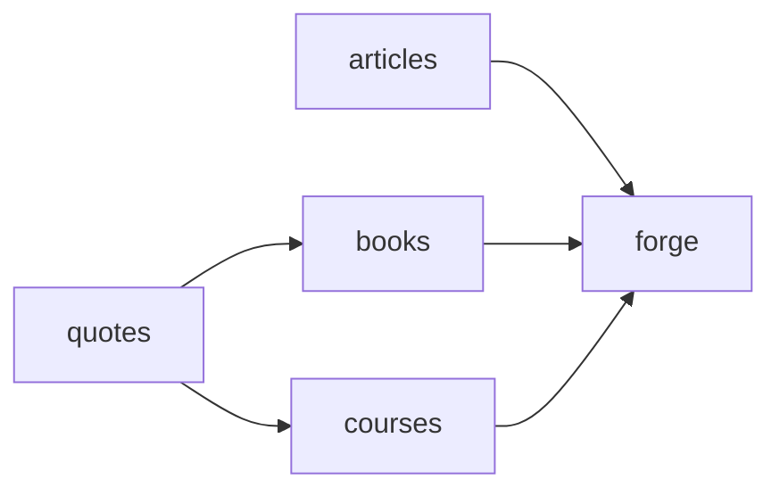

---
{"dg-publish":true,"date":"2024-11-06T22:20:46+03:00","modified_at":"2024-12-04T13:21:35+03:00","title":"Шахта Ванадия","aliases":"Шахта Ванадия","permalink":"/mine/index/","dgPassFrontmatter":true}
---

Здесь, в отличие от [[forge/index|кузницы]], мы будем добывать знания. Чем-то этот подход напоминает [[openbox/progressive summarization|progressive summarization]], просто помноженный на синдром "раскладывания по папочкам". Воспроизвожу то, что получилось в ящике.

Структура такая:
- `quotes` - просто дословные цитаты с указанием источника, может быть внутренняя ссылка в случае книги или курса или просто внешняя ссылка. (*todo:* подумать не является ли это переизобритением Zotero)
- `books` - выдержки из книг, сделанные на основе цитат
- `courses` - отзыв на курс, и цитаты оттуда
- `articles` - выдержка из статьи, сделанная с помощью [[openbox/progressive summarization|progressive summarization]]

Тоже самое, но для понимания процесса:

